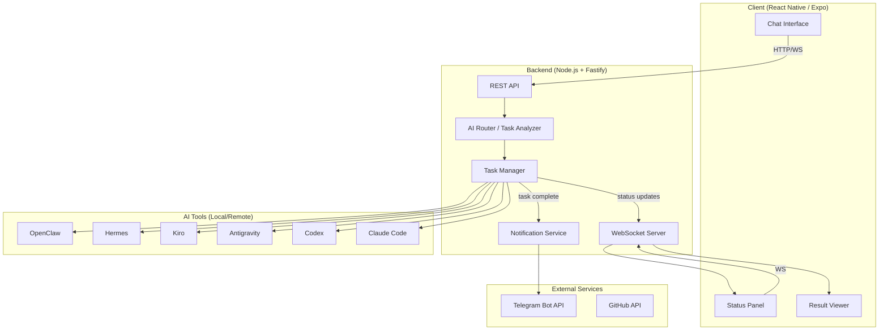

# AI Command Center — Project Specification

## 1. Product Overview

**AI Command Center** is a chat-first application for managing and orchestrating multiple AI tools (OpenClaw, Hermes, Kiro, Antigravity, Codex, Claude Code) from a single interface.

**Core concept:** User types a task in natural language → app analyzes and suggests the best AI tool with reasoning → user confirms → app dispatches the task and returns results.

**Target platforms:** Mobile (iOS/Android) + Desktop (Web)

**Target user:** Non-programmer power user who uses multiple AI tools daily and needs a unified control point.

### Key Principles
- **Chat-first UX** — one input box, natural language
- **Human-in-the-loop** — app suggests, user confirms
- **Transparency** — always show why a tool was chosen
- **Real-time status** — know what's running at all times
- **Notify everywhere** — results in-app + Telegram

---

## 2. Architecture

### System Diagram



### Components

| Component | Responsibility | Tech |
|-----------|---------------|------|
| **Chat Interface** | User input, conversation display | React Native (Expo) |
| **Status Panel** | Real-time tool status | WebSocket + React |
| **Result Viewer** | Display task outputs | Markdown renderer |
| **REST API** | Request handling, auth | Fastify |
| **AI Router** | Analyze task → suggest tool | LLM-based classifier |
| **Task Manager** | Dispatch, monitor, collect results | Node.js workers |
| **WebSocket Server** | Real-time status push | ws / Socket.io |
| **Notification Service** | Telegram alerts | Telegram Bot API |
| **SQLite DB** | Tasks, history, preferences | better-sqlite3 |

---

## 3. Task Breakdown

### Phase 1: MVP (Chat + Smart Routing + Status)

| ID | Task | Description | Dependencies | Effort | Agent |
|----|------|-------------|--------------|--------|-------|
| T01 | Project scaffolding | Init Expo project (React Native), backend (Fastify), monorepo structure | None | M | coding |
| T02 | Database schema | Design and create SQLite schema for tasks, tools, history | None | S | coding |
| T03 | Backend API — core endpoints | POST /tasks, GET /tasks, GET /tasks/:id, GET /tools/status | T01, T02 | M | coding |
| T04 | AI Router — tool classifier | LLM prompt that analyzes task description and returns tool recommendation + reasoning | T01 | M | coding |
| T05 | Tool adapters — OpenClaw | Adapter to launch/monitor/get results from OpenClaw CLI | T03 | M | coding |
| T06 | Tool adapters — Hermes | Adapter for Hermes agent | T03 | M | coding |
| T07 | Tool adapters — Antigravity | Adapter for Antigravity (via MCP bridge) | T03 | M | coding |
| T08 | Tool adapters — Codex | Adapter for OpenAI Codex CLI | T03 | M | coding |
| T09 | Tool adapters — Claude Code | Adapter for Claude Code CLI | T03 | M | coding |
| T10 | Tool adapters — Kiro | Adapter for Kiro IDE | T03 | S | coding |
| T11 | WebSocket — real-time status | WS server pushing tool status + task progress | T03 | M | coding |
| T12 | Chat UI — mobile | Chat input, message list, tool suggestion cards | T01 | L | coding |
| T13 | Status Panel UI | Real-time tool status display (running/idle/error) | T11, T12 | M | coding |
| T14 | Result Viewer UI | Display task output (markdown, code, logs) | T12 | M | coding |
| T15 | Smart routing flow | Full flow: user input → AI Router → suggestion card → confirm → dispatch | T04, T12 | L | coding |
| T16 | Integration testing | End-to-end test: submit task → route → execute → return result | T05-T15 | L | tester |
| T17 | Telegram notifications | Send task completion alerts via Telegram Bot | T03 | S | coding |

### Phase 2: v1.0 (Polish + History + Preferences)

| ID | Task | Description | Dependencies | Effort | Agent |
|----|------|-------------|--------------|--------|-------|
| T18 | Task history | View past tasks, filter by tool/status/date | T16 | M | coding |
| T19 | User preferences | Remember preferred tools per task type | T16 | M | coding |
| T20 | Cost tracking | Token usage estimation per tool per task | T16 | M | coding |
| T21 | Error recovery | Retry failed tasks, switch to alternative tool | T16 | M | coding |
| T22 | Desktop web UI | Responsive web version (same codebase via Expo Web) | T16 | M | coding |
| T23 | UI polish | Animations, loading states, empty states, dark mode | T22 | M | coding |
| T24 | Security review | Auth, input validation, secrets handling | T22 | M | reviewer |
| T25 | Performance testing | Load test, response time benchmarks | T22 | M | tester |

### Phase 3: v2.0 (Advanced)

| ID | Task | Description | Dependencies | Effort | Agent |
|----|------|-------------|--------------|--------|-------|
| T26 | Multi-tool orchestration | Chain multiple tools for complex tasks | T25 | L | coding |
| T27 | Template tasks | Save and reuse common task patterns | T25 | M | coding |
| T28 | Team sharing | Share tasks/results with team members | T25 | L | coding |
| T29 | Plugin system | Allow adding new AI tools without code changes | T25 | L | coding |
| T30 | Voice input | Speech-to-text for task input | T25 | M | coding |

---

## 4. Tech Stack

| Layer | Technology | Version | Reason |
|-------|-----------|---------|--------|
| **Frontend** | React Native (Expo) | SDK 53 | Cross-platform (iOS, Android, Web) from single codebase |
| **Navigation** | Expo Router | v4 | File-based routing, works on all platforms |
| **State** | Zustand | ^5.0 | Lightweight, no boilerplate |
| **Styling** | NativeWind (Tailwind) | v4 | Familiar utility-first CSS |
| **Backend** | Node.js + Fastify | Node 22+ / Fastify 5 | Fast, low overhead, TypeScript native |
| **Database** | SQLite (better-sqlite3) | ^11.0 | Local-first, zero config, fast |
| **WebSocket** | ws | ^8.0 | Lightweight WS for Node.js |
| **AI Router** | 9router API (LLM) | — | Use existing 9router setup for classification |
| **Notifications** | Telegram Bot API | — | Already configured in OpenClaw |
| **Monorepo** | Turborepo | ^2.0 | Shared types, parallel builds |
| **Language** | TypeScript | ^5.5 | Type safety across full stack |
| **Package Manager** | pnpm | ^9.0 | Fast, disk efficient |

---

## 5. API Design

### Core Endpoints

```
POST   /api/tasks              — Submit a new task
GET    /api/tasks              — List tasks (with filters)
GET    /api/tasks/:id          — Get task details + result
POST   /api/tasks/:id/confirm  — Confirm tool suggestion, start execution
POST   /api/tasks/:id/cancel   — Cancel running task
GET    /api/tools              — List all tools + current status
GET    /api/tools/:id/status   — Get specific tool status
GET    /api/history            — Task history with stats
GET    /api/preferences        — User tool preferences
PUT    /api/preferences        — Update preferences
WS     /ws                     — Real-time status + task updates
```

### Request/Response Examples

#### POST /api/tasks
```json
// Request
{
  "description": "Viết API login bằng Python với FastAPI",
  "context": {
    "project": "my-backend",
    "language": "python"
  }
}

// Response
{
  "id": "task_abc123",
  "status": "pending_confirmation",
  "suggestion": {
    "tool": "antigravity",
    "reason": "Task yêu cầu viết code Python — Antigravity mạnh về autonomous coding với context dài",
    "confidence": 0.85,
    "alternatives": [
      { "tool": "codex", "reason": "Cũng hỗ trợ Python, nhưng ít context hơn" }
    ]
  }
}
```

#### POST /api/tasks/:id/confirm
```json
// Request
{ "confirmed_tool": "antigravity" }

// Response
{
  "id": "task_abc123",
  "status": "running",
  "tool": "antigravity",
  "started_at": "2026-05-18T10:00:00Z"
}
```

#### WebSocket Events
```json
// Server → Client: Tool status change
{ "type": "tool_status", "tool": "openclaw", "status": "running", "task_id": "task_abc123" }

// Server → Client: Task progress
{ "type": "task_progress", "task_id": "task_abc123", "progress": 60, "message": "Generating code..." }

// Server → Client: Task complete
{ "type": "task_complete", "task_id": "task_abc123", "result": { "output": "...", "files": [...] } }
```

---

## 6. Data Models

### Tasks Table
```sql
CREATE TABLE tasks (
  id TEXT PRIMARY KEY,
  description TEXT NOT NULL,
  context JSON,
  status TEXT NOT NULL DEFAULT 'pending',  -- pending | pending_confirmation | running | completed | failed | cancelled
  suggested_tool TEXT,
  suggestion_reason TEXT,
  confirmed_tool TEXT,
  result JSON,
  error TEXT,
  created_at DATETIME DEFAULT CURRENT_TIMESTAMP,
  started_at DATETIME,
  completed_at DATETIME,
  tokens_used INTEGER DEFAULT 0,
  cost_estimate REAL DEFAULT 0
);
```

### Tools Table
```sql
CREATE TABLE tools (
  id TEXT PRIMARY KEY,           -- openclaw, hermes, kiro, antigravity, codex, claude-code
  name TEXT NOT NULL,
  status TEXT DEFAULT 'idle',    -- idle | running | error | offline
  last_active DATETIME,
  config JSON,                   -- tool-specific config (paths, ports, etc.)
  capabilities JSON              -- what this tool is good at
);
```

### History Table
```sql
CREATE TABLE task_history (
  id INTEGER PRIMARY KEY AUTOINCREMENT,
  task_id TEXT REFERENCES tasks(id),
  event TEXT NOT NULL,           -- created | suggested | confirmed | started | progress | completed | failed
  data JSON,
  timestamp DATETIME DEFAULT CURRENT_TIMESTAMP
);
```

### Preferences Table
```sql
CREATE TABLE preferences (
  id INTEGER PRIMARY KEY AUTOINCREMENT,
  task_pattern TEXT NOT NULL,    -- regex or keyword pattern
  preferred_tool TEXT NOT NULL,
  weight REAL DEFAULT 1.0,
  created_at DATETIME DEFAULT CURRENT_TIMESTAMP
);
```

---

## 7. UI Wireframes (Text-based)

### Screen 1: Main Chat
```
┌─────────────────────────────────────┐
│  AI Command Center          [⚙️]    │
├─────────────────────────────────────┤
│                                     │
│  ┌─────────────────────────────┐    │
│  │ 🟢 OpenClaw  🟢 Hermes     │    │
│  │ 🟡 Kiro     🟢 Antigravity │    │
│  │ ⚫ Codex    🟢 Claude Code │    │
│  └─────────────────────────────┘    │
│                                     │
│  You: Viết API login bằng Python    │
│                                     │
│  ┌─────────────────────────────┐    │
│  │ 💡 Gợi ý: Antigravity      │    │
│  │                             │    │
│  │ Lý do: Task yêu cầu viết   │    │
│  │ code Python — Antigravity   │    │
│  │ mạnh về autonomous coding   │    │
│  │                             │    │
│  │ [✅ Confirm]  [🔄 Đổi tool] │    │
│  └─────────────────────────────┘    │
│                                     │
├─────────────────────────────────────┤
│  [💬 Nhập task của bạn...]    [➤]  │
└─────────────────────────────────────┘
```

### Screen 2: Task Running
```
┌─────────────────────────────────────┐
│  AI Command Center          [⚙️]    │
├─────────────────────────────────────┤
│                                     │
│  ┌─────────────────────────────┐    │
│  │ 🔄 Antigravity — Running    │    │
│  │ ████████░░░░░░░░ 45%        │    │
│  │ "Generating FastAPI code..." │    │
│  │                             │    │
│  │ ⏱️ 2m 30s elapsed           │    │
│  │ [❌ Cancel]                  │    │
│  └─────────────────────────────┘    │
│                                     │
│  Previous tasks:                    │
│  ✅ "Setup database" — OpenClaw     │
│  ✅ "Write tests" — Codex           │
│                                     │
├─────────────────────────────────────┤
│  [💬 Nhập task của bạn...]    [➤]  │
└─────────────────────────────────────┘
```

### Screen 3: Result View
```
┌─────────────────────────────────────┐
│  AI Command Center          [⚙️]    │
├─────────────────────────────────────┤
│                                     │
│  ✅ Task completed (3m 12s)         │
│  Tool: Antigravity                  │
│                                     │
│  ┌─────────────────────────────┐    │
│  │ 📄 Output:                  │    │
│  │                             │    │
│  │ Created files:              │    │
│  │ • src/auth/router.py        │    │
│  │ • src/auth/models.py        │    │
│  │ • src/auth/utils.py         │    │
│  │                             │    │
│  │ ```python                   │    │
│  │ @router.post("/login")      │    │
│  │ async def login(...)        │    │
│  │ ```                         │    │
│  │                             │    │
│  │ [📋 Copy] [📤 Share] [👁️]  │    │
│  └─────────────────────────────┘    │
│                                     │
├─────────────────────────────────────┤
│  [💬 Nhập task của bạn...]    [➤]  │
└─────────────────────────────────────┘
```

### Screen 4: Status Panel (expanded)
```
┌─────────────────────────────────────┐
│  Tool Status                [← Back]│
├─────────────────────────────────────┤
│                                     │
│  🟢 OpenClaw         v2026.5.12     │
│     Port: 18789 | Model: sonnet-4.6 │
│     Last active: 2 min ago          │
│                                     │
│  🟢 Hermes           v0.14.0        │
│     Status: idle                    │
│     Last active: 15 min ago         │
│                                     │
│  🟡 Kiro             v1.2.0         │
│     Status: starting...             │
│                                     │
│  🟢 Antigravity      v2.1.0         │
│     Status: running task_abc123     │
│     Progress: 45%                   │
│                                     │
│  ⚫ Codex            —              │
│     Status: offline                 │
│     [▶️ Start]                       │
│                                     │
│  🟢 Claude Code      v1.8.0         │
│     Status: idle                    │
│     Last active: 1 hour ago         │
│                                     │
└─────────────────────────────────────┘
```

---

## 8. Milestones

### MVP (Phase 1) — 2-3 weeks
**Goal:** Working chat interface that can route tasks to at least 2 tools

- [ ] T01: Project scaffolding
- [ ] T02: Database schema
- [ ] T03: Backend API
- [ ] T04: AI Router
- [ ] T05: OpenClaw adapter
- [ ] T07: Antigravity adapter
- [ ] T11: WebSocket status
- [ ] T12: Chat UI
- [ ] T13: Status Panel
- [ ] T15: Smart routing flow
- [ ] T16: Integration testing
- [ ] T17: Telegram notifications

**Success criteria:** User can type a task → get tool suggestion → confirm → see result

### v1.0 (Phase 2) — 2-3 weeks after MVP
**Goal:** All 6 tools integrated, history, preferences, desktop support

- [ ] T06, T08, T09, T10: Remaining tool adapters
- [ ] T14: Result Viewer
- [ ] T18-T25: History, preferences, cost, error recovery, polish

**Success criteria:** All tools working, task history searchable, desktop web UI

### v2.0 (Phase 3) — Future
**Goal:** Advanced orchestration, templates, team features

- [ ] T26-T30: Multi-tool chains, templates, team, plugins, voice

**Success criteria:** Complex multi-step tasks automated end-to-end

---

## 9. AI Router Logic

The AI Router uses an LLM to classify tasks. Here's the routing prompt template:

```
You are a task router for AI development tools. Given a task description, suggest the best tool.

Available tools:
- OpenClaw: Multi-agent orchestration, chat automation, file operations, web research, Telegram integration
- Hermes: Python-based agent, good for Python scripting, data processing, local automation
- Kiro: AI IDE by AWS, good for full project development with specs and hooks
- Antigravity: Google's coding agent, excellent for autonomous long-context coding, architecture
- Codex: OpenAI CLI, good for quick code generation, edits, explanations
- Claude Code: Anthropic CLI, strong reasoning, code review, complex refactoring

Task: "{user_task_description}"
Context: {optional_context}

Respond with:
{
  "tool": "<tool_id>",
  "reason": "<1-2 sentences in Vietnamese explaining why>",
  "confidence": <0.0-1.0>,
  "alternatives": [{"tool": "<id>", "reason": "<why this could also work>"}]
}
```

### Routing heuristics (fallback when LLM unavailable):
- Contains "Python" / "script" → Hermes
- Contains "code" / "viết" / "tạo" + programming language → Antigravity
- Contains "review" / "refactor" / "explain" → Claude Code
- Contains "quick" / "nhanh" / "edit" → Codex
- Contains "research" / "tìm" / "search" → OpenClaw
- Contains "project" / "full app" / "spec" → Kiro
- Default → OpenClaw (most versatile)

---

## 10. Security Considerations

- **No secrets in client** — API keys stored server-side only
- **Tool isolation** — each adapter runs in separate process
- **Input sanitization** — prevent prompt injection in task descriptions
- **Auth** — local-first (no auth for single user), optional PIN for mobile
- **Telegram bot token** — reuse existing OpenClaw bot, don't expose new tokens
- **Result sanitization** — strip sensitive data before displaying

---

## 11. Development Workflow

Using OpenClaw multi-agent system:
- **planner** → creates specs and task breakdowns
- **coding** → implements features
- **reviewer** → code review before merge
- **tester** → writes and runs tests
- **main** → coordinates, handles git operations

Each task follows:
1. Agent implements the task
2. Reviewer checks code quality
3. Tester verifies functionality
4. Main commits and pushes to GitHub
